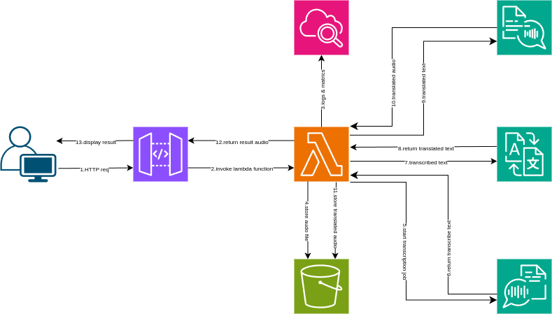

# AWS Serverless Translator 🌐✨

AWS Serverless Translator is a simple translator web app leveraging serverless technology on AWS. This project provides a user-friendly web interface for translating text, using JavaScript for backend logic and an HTML/CSS frontend.

## Features 🚀

- 🌍 Translate input text between languages
- 🖥️ Clean, simple, and responsive user interface
- ☁️ Built using serverless architecture for easy scalability

## Project Structure 🗂️

| File/Folder       | Description                                              |
|-------------------|----------------------------------------------------------|
| `server.js`       | ⚙️ Node.js backend logic for translation requests         |
| `translator.html` | 📝 Main frontend HTML file (user interface)               |
| `style.css`       | 🎨 Stylesheet for the web page                            |
| `images/`         | 🖼️ Folder for any images used in the UI                   |

## Images Included 🖼️

Here is the flow of aws serverless translator:

-  
- for more images look images directory

## Technologies Used 🛠️

- **JavaScript (Node.js):** Backend logic
- **HTML:** Frontend structure
- **CSS:** Frontend styling
- **AWS Services:**  
  - Amazon API Gateway  
  - AWS Lambda  
  - Amazon S3  
  - Amazon CloudWatch  
  - Amazon SNS  
  - Amazon Transcribe  
  - Amazon Translate  
  - Amazon Polly

## How to Use 🏗️

1. **Clone the repository:**  
    ```
    git clone https://github.com/Rudra-Langote/AWS-serverless-translator.git
    cd AWS-serverless-translator
    ```

2. **Set up AWS credentials and environment** (details to be added based on `server.js` requirements).

3. **Start the backend:**  
    ```
    node server.js
    ```

4. **Open `translator.html` in your browser** to access the translator UI.

## Contributing 🤝

1. 🍴 Fork the repository.
2. 🌱 Create your feature branch (`git checkout -b feature/YourFeature`).
3. 💾 Commit your changes.
4. 🚀 Push to your branch.
5. 📬 Create a Pull Request.

---
